**[Download the slides here as a PDF](webinar_slides.pdf)**.

After writing my [recent post on emergency remote teaching](/post/emergency-remote-teaching-a-post-secondary-reality-check/), I was invited by the [Canadian Association of University Teachers](https://www.caut.ca/) to give a short talk as part of their [first COVID-19 town hall](https://twitter.com/CAUT_ACPPU/status/1250780456511049735). My own remarks can be seen above, and the [slides](webinar_slides.pdf) are reasonably comprehensive about what I said. 

Alternatively, you can scroll through them below. Enjoy, and stay safe and healthy.

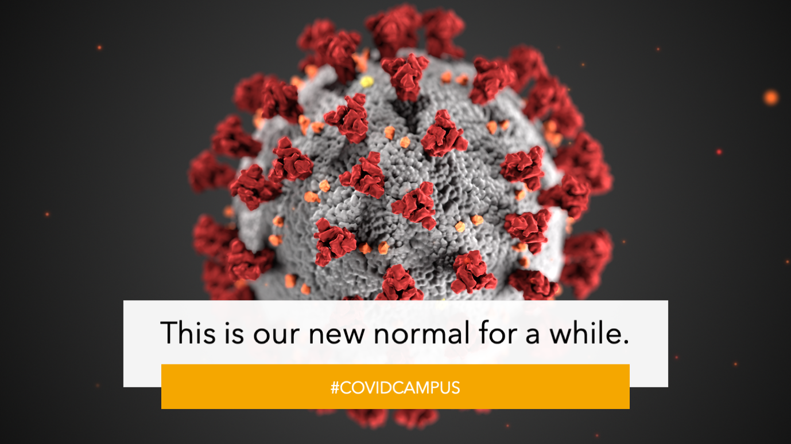
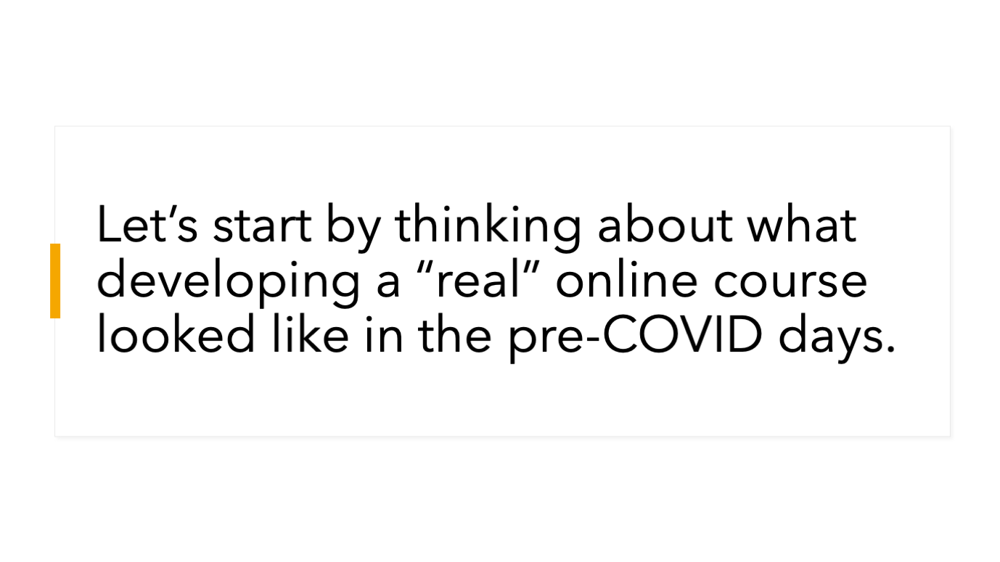

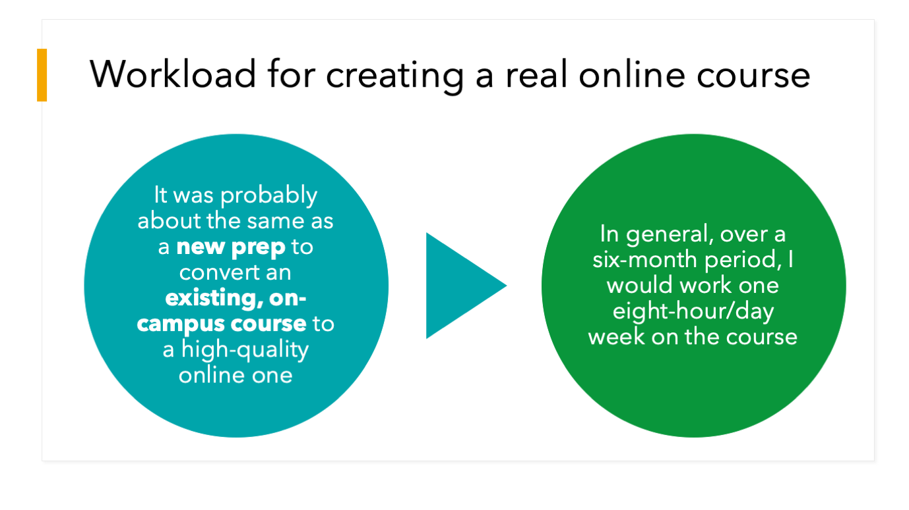
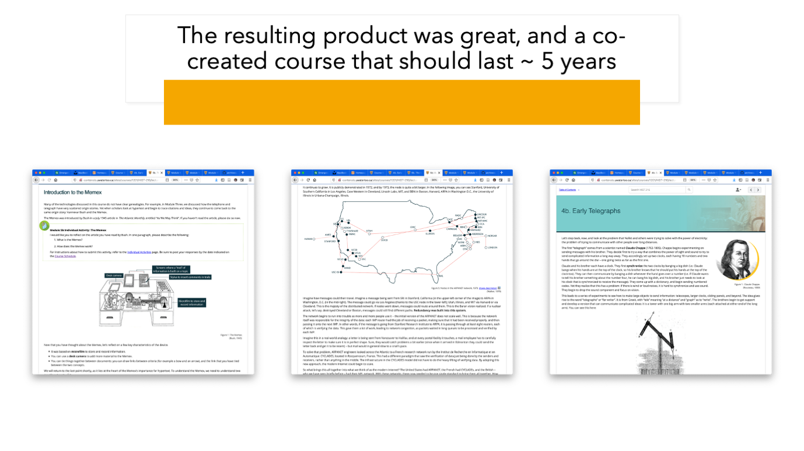

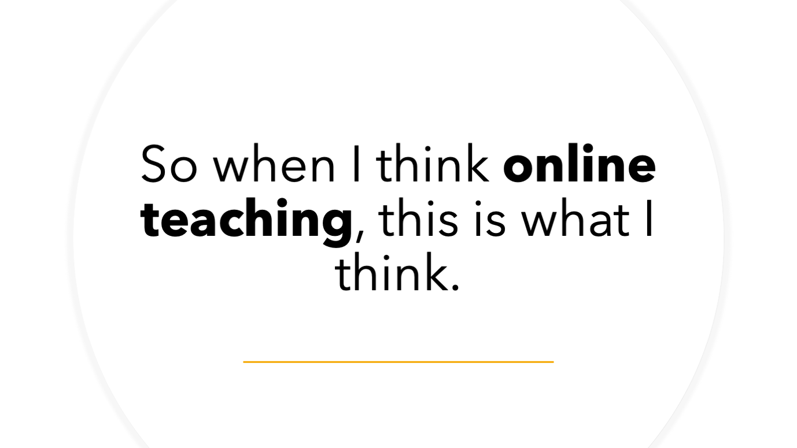

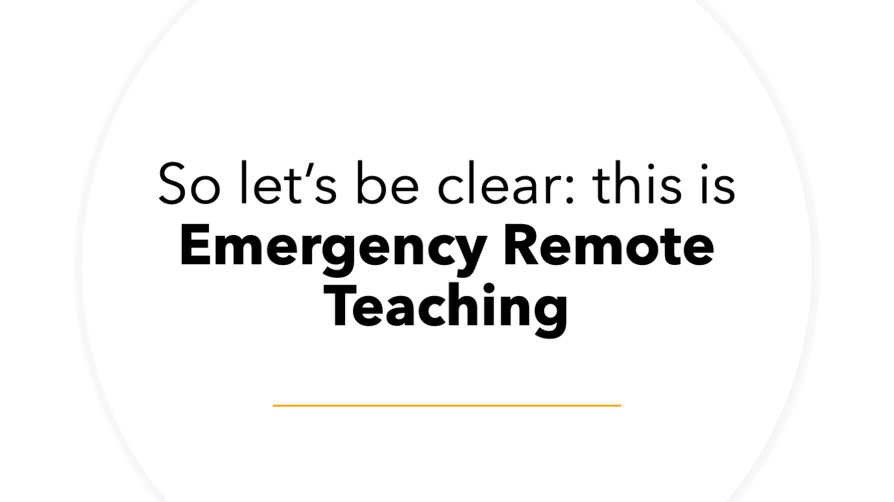
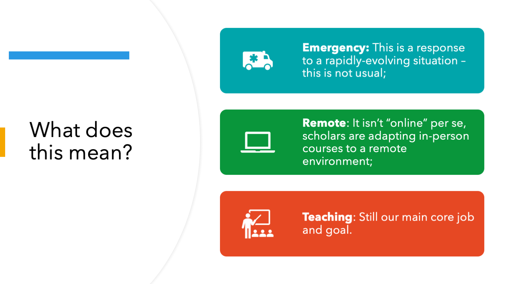
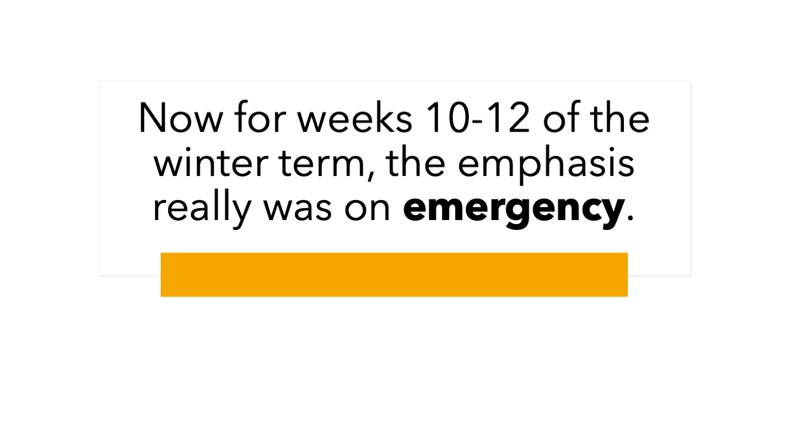
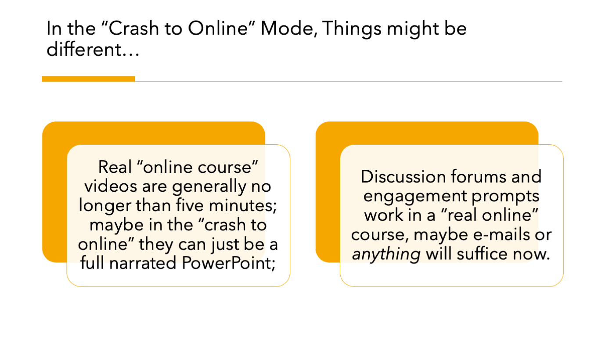
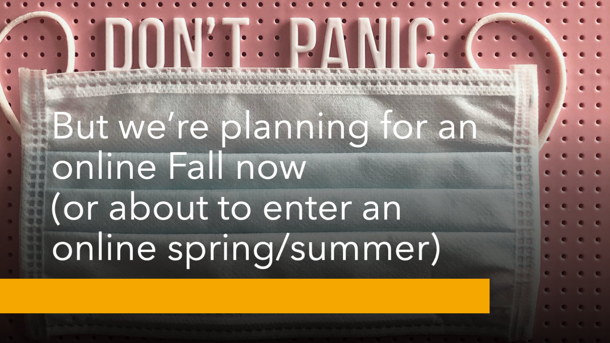
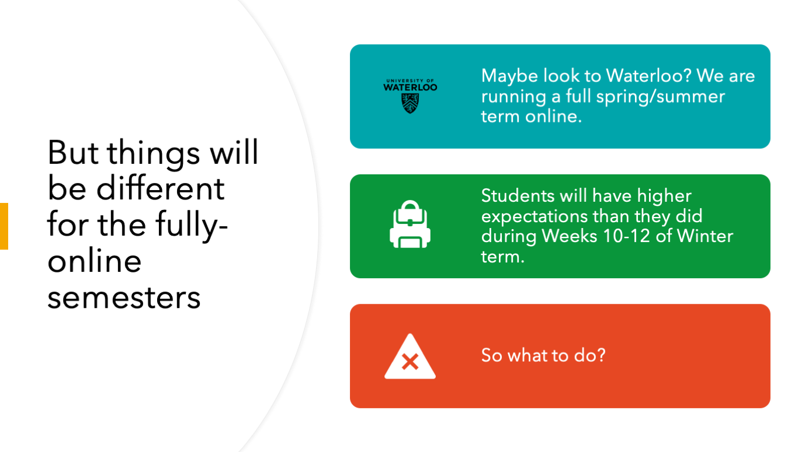
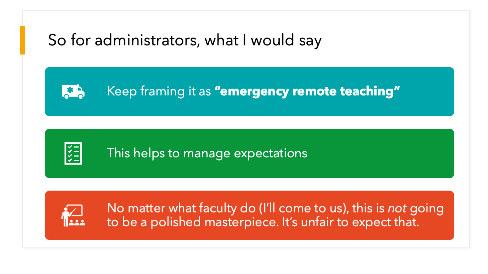
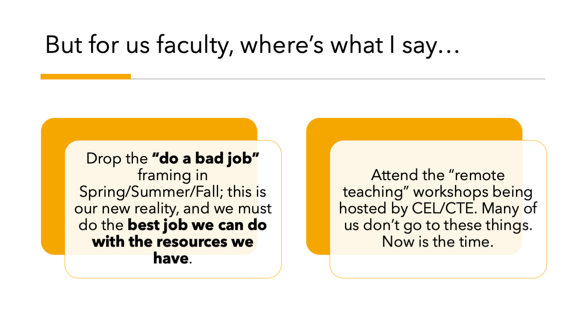

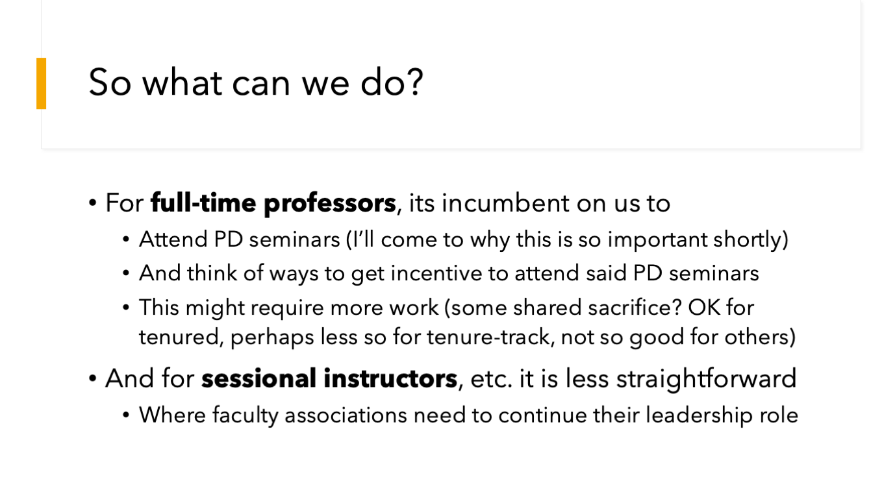

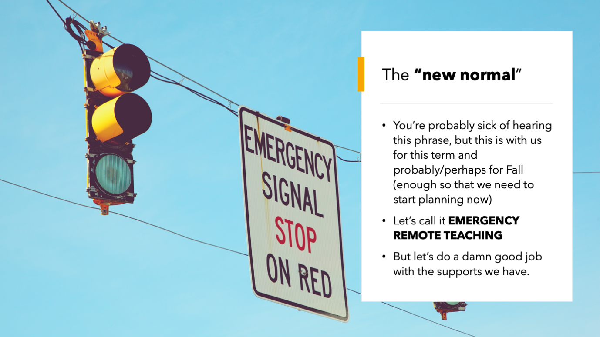
