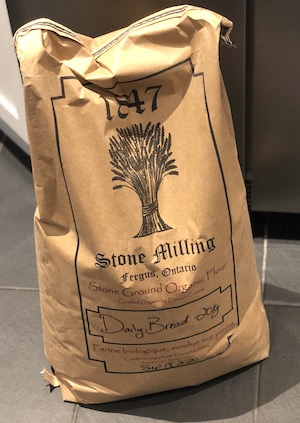
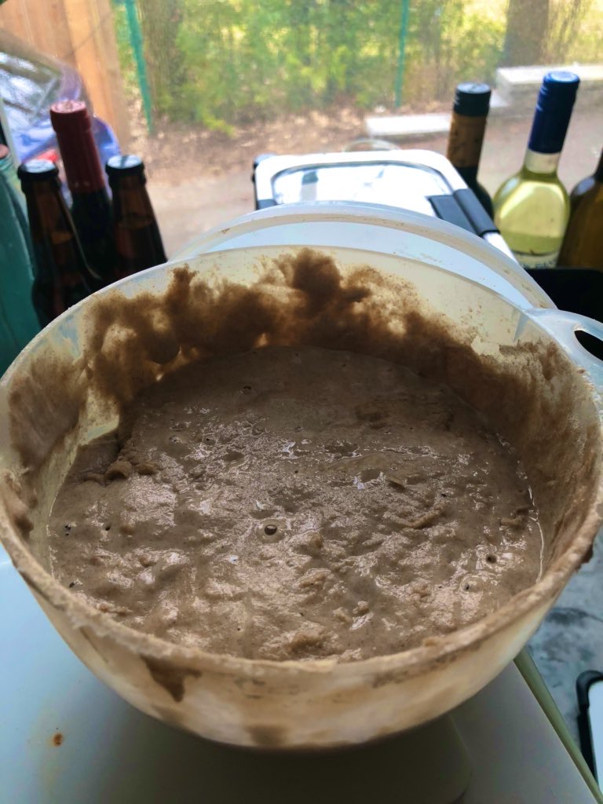
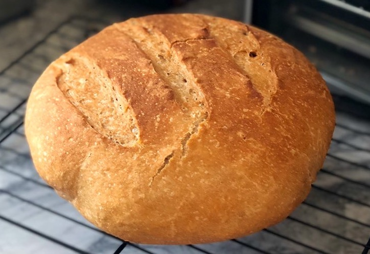
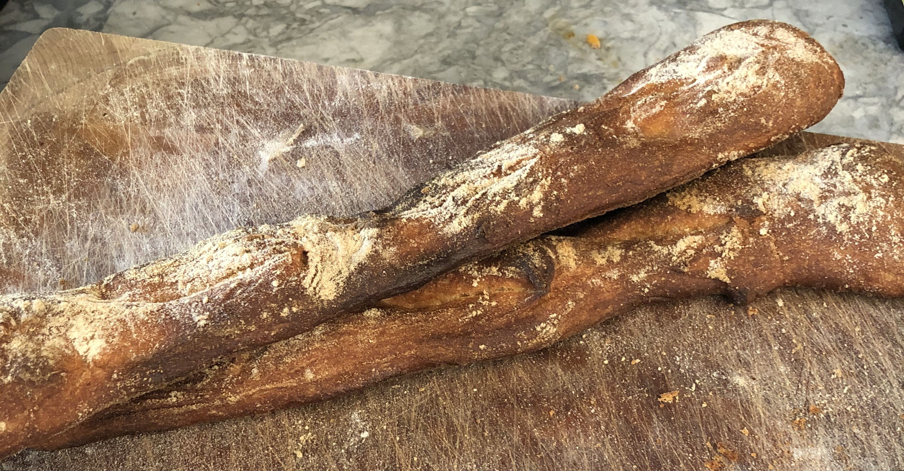

*Meandering bread post ahead! Stay tuned for more web archiving content soon..*

When I've been on parental leave (twice), I've turned to breadmaking: it's the sort of thing that I need to be in a rhythm to do, as while it's not crazy time consuming, it does often require lots of touch points throughout the day.

With COVID-19 locking us all down for most of the day (we can still take walks around the block in Ontario, thank god), I've turned back to baking --- now with the help of my kids. I know I'm not alone, judging by my Twitter timeline (only about 5% bread, let's make it 20%) as well as the barren flour/yeast selections at my local grocery store.

But, hey, as I now spend a fair bit of every day baking bread, why not share some of the recipes I've been using with a lot of success?

## Getting Flour

While clearly there's no shortage of flour in Canada (c'mon), there is a shortage of it at the grocery store as supply chains are strained by the rapid interest in home baking.

Luckily, I tweeted about my first loaf and somebody mentioned a local stone mill in Fergus, Ontario (about a 30 minute drive from my house, although they deliver for free with an order over $75). One order later, and a 20kg bag of flour arrived. Now that I've used about half of it in the last three and a half-weeks of COVID-19 lockdown, the remainder doubles as a handy chair for my daughter to sit on.

Anyways, you can buy it from their [website here](https://1847.ca/).

## No-Knead Bread

When I've been on parental leave, I've basically made this on an every-other-day-basis. COVID-19, it turns out, is no different. You can find this recipie in a million different places, and I'm leery to attribute it to any one place as my own recipie comes from a family card. [But this is more or less what I use](https://pinchofyum.com/no-knead-bread).

I've made it so many times it's just muscle memory. The night before (usually around 9pm), I combine this in a bowl and mix with a wooden spoon:

* 3 cups flour
* 1 1/2 teaspoon salt
* 1/2 teaspoon yeast
* 1.5 cups lukewarm water

I then cover it (I used to use saran wrap, now I just put a loose lid over my bowl) and come back to it around 10am the next morning. 

I'm lazy, so my dutch oven is already sitting in the oven. The first thing I do is set the oven to 450 for 45 minutes (about 10-15 for my oven to warm up, as it's a slow one, and then 30 minutes to get the oven up to speed).

Right before the dutch oven comes out, I make the loaf. The trick is to then flour your hands and a surface, flop it out of the bowl and _very gently_ (honestly, don't knead, it's called "no knead" both because you don't have to knead, but also, kneading seems to wreck it) shape it, put it on parchment paper, and into the super hot dutch oven.

Thirty minutes at 450, then I take the lid off, 15 more minutes.. and voila, you've got an awesome loaf of bread (pictured above). 

## Sourdough

Now, I've always wanted to make sourdough: I'd heard about "starters" but didn't really know what any of that meant. 

### The Starter

Then I decided to just follow the steps here at [King Arthur Flour](https://www.kingarthurflour.com/recipes/sourdough-starter-recipe). Describing it as a magic adventure with my son, we just basically set it out near our window (I do all my baking near a nice window, so maybe the yeast already know it's a cool place to hang out); things started to bubble a bit on Day Two, and by Day Five, it would reliably double on each feeding.

Here's my starter:

### The Bread

I then decided to try making my first sourdough using the [Rustic Sourdough Bread](https://www.kingarthurflour.com/recipes/rustic-sourdough-bread-recipe) recipe at King Arthur Flour. The first time I made it, it tasted okay, but didn't really rise as much as I wanted. While I wondered if that might be the stone-milled bread flour I was using, I also figured it was because I didn't really know how to "knead" bread, nor how to "shape it into a ball."

Fortunately, YouTube to the rescue. First, I watched a great video on how to [knead dough](https://www.youtube.com/watch?v=ySOj0fFWo1U) and then another on how to shape it (h/t to [Heather Steel](https://twitter.com/steelha1/status/1246540003586572295)):


  
From these two videos alone, the results were top-notch. I might try doing a mixture of standard all-purpose and stone-milled bread flour next, but as it is, I'm pretty thrilled.

## Baguettes and Other Misses

I've had some other hits and misses – my baguettes ([inspired by Mat Kelly to make these](https://twitter.com/machawk1/status/1245407357720559618)!) were too small, but it's all part of the learning adventure. And most importantly, my kids are having a great time learning to bake with me, and it's something more productive to do than refresh the _Globe and Mail_ or the _New York Times_ every five minutes....

*Hat tip to bread twitter: too many to mention, but especially [Melonie Fullick](https://twitter.com/qui_oui), [Heather Steel](https://twitter.com/steelha1), [Mat Kelly](https://twitter.com/machawk1), [Jim Clifford](https://twitter.com/jburnford) who have all given super-awesome advice, and all of you who keep me sane by tweeting pictures of bread instead of exponential-growth diagrams.*