My family had a "PowerPoint" party for my stepdad's birthday – each member of the family had to give a presentation on something, be it the merits of a Stone Cold Steve Austin movie, important events from that day, biographies of other local mayors, the D & D alignment of all family members, evolving fashion styles, etc. etc. As those of you who follow me on Twitter know, with the COVID-19 lockdowns, I've been spending _a lot_ of time with our PAW Patrol obsessed child.

This has, similarly, led to _a lot_ of thinking from _me_ on just how this wonderful universe works.

So without further adieu, here's my contribution: **"The Economy of Adventure Bay." With apologies to scholars who actually work in this field.

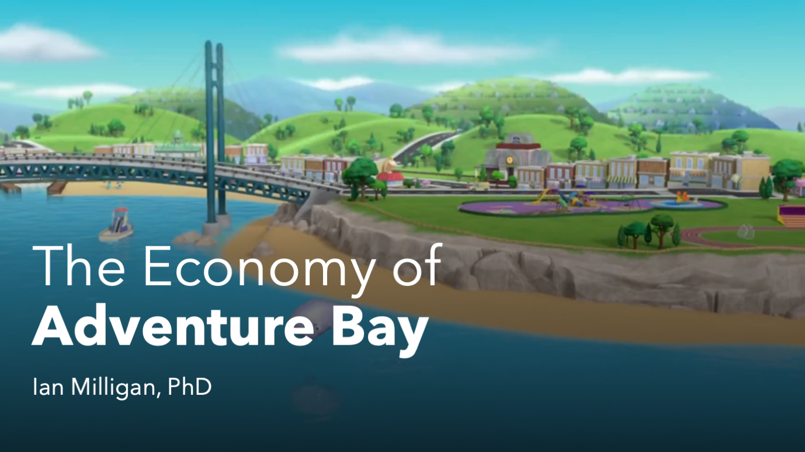
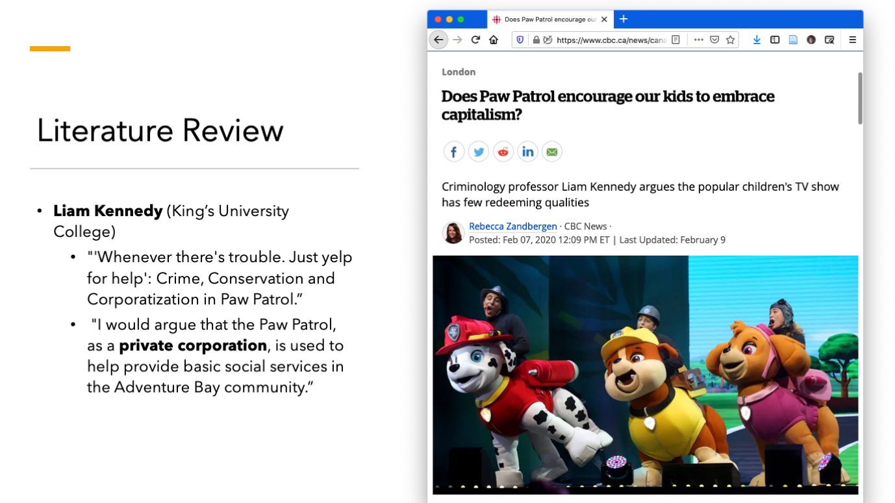
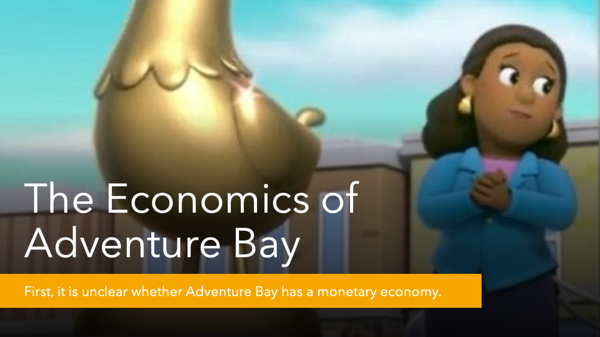
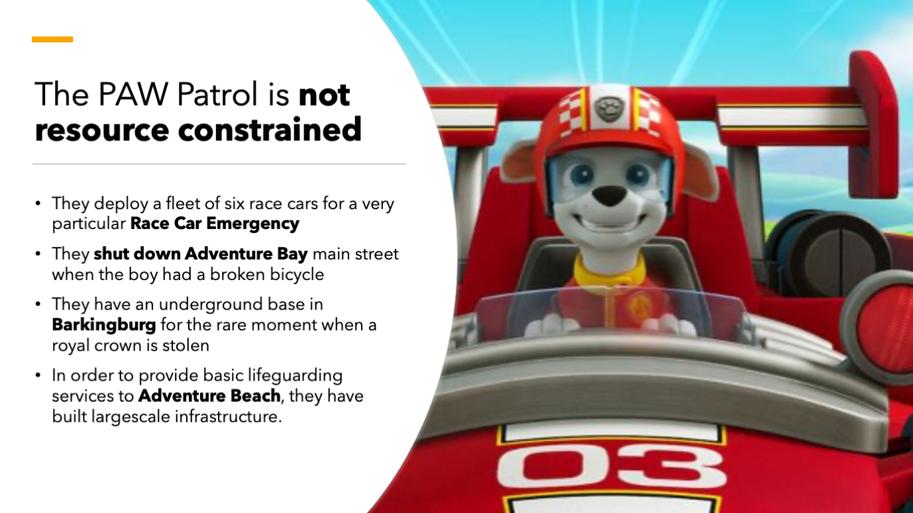
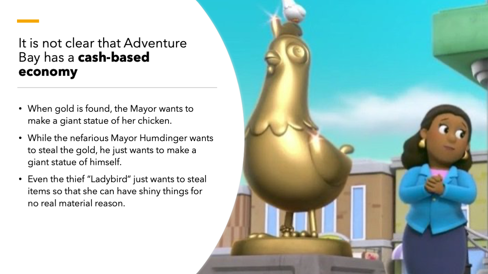
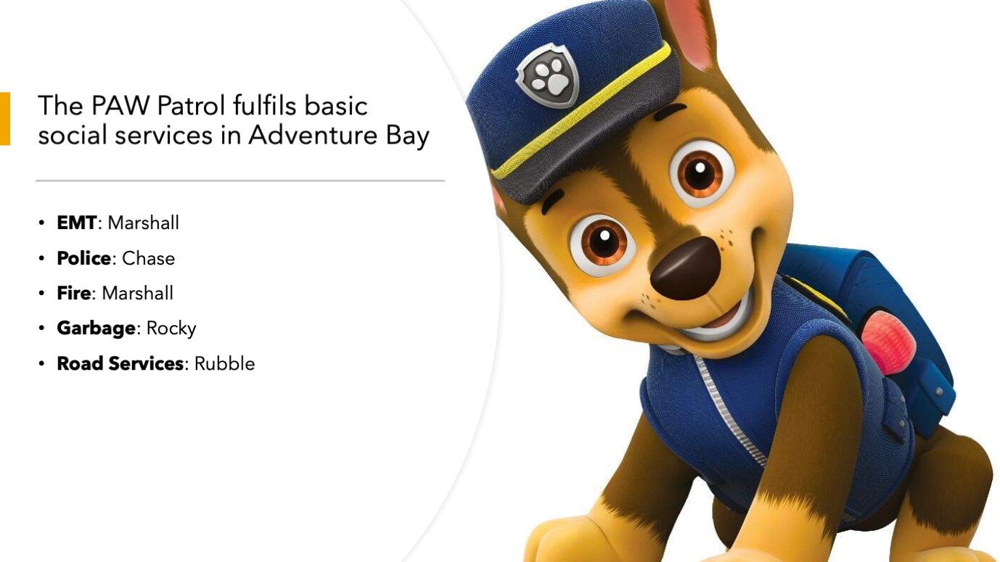
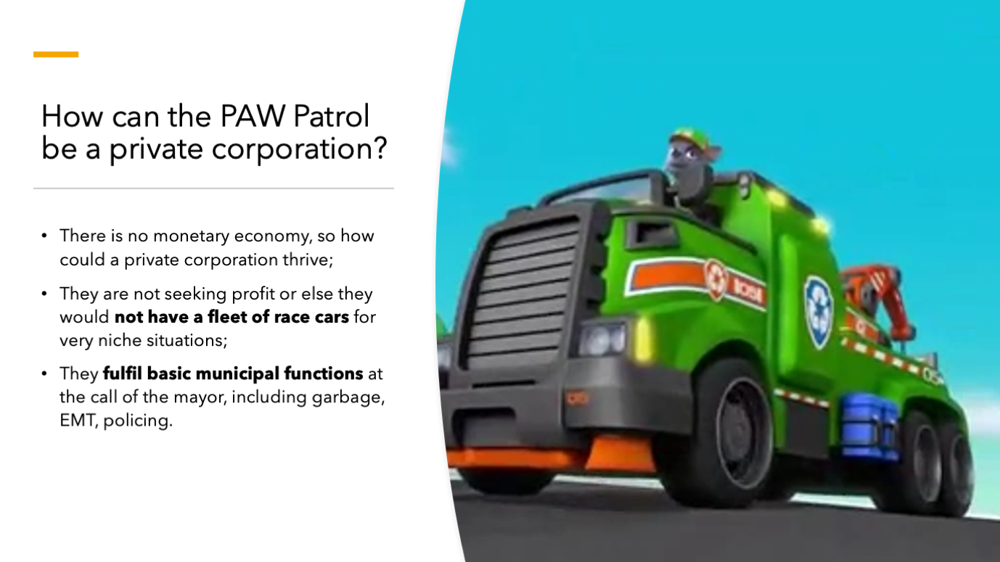
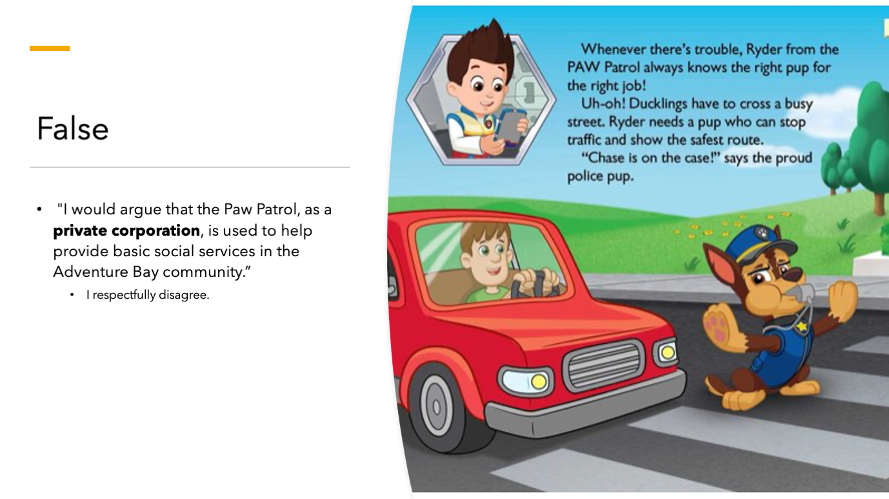
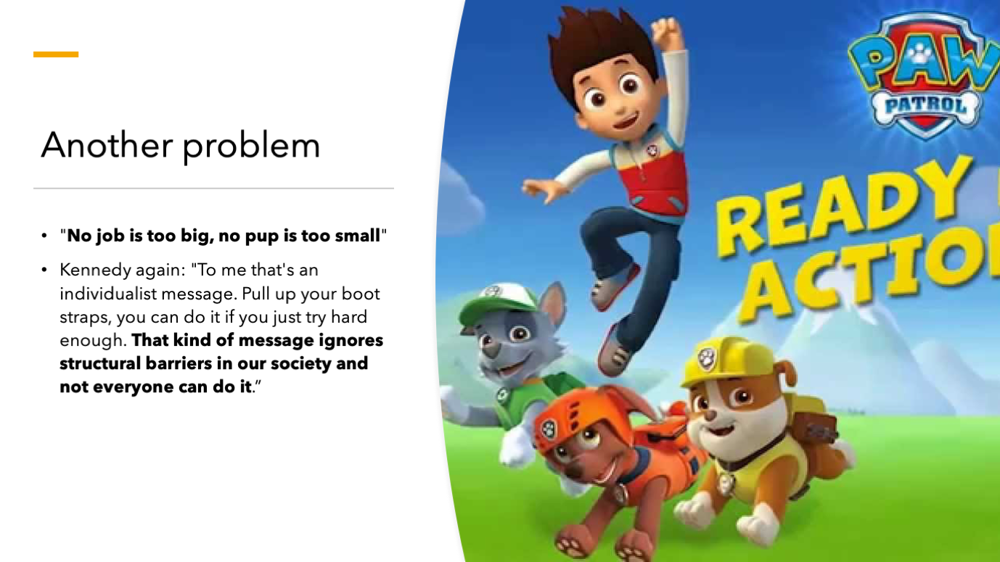
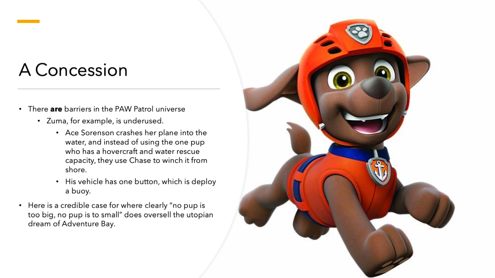
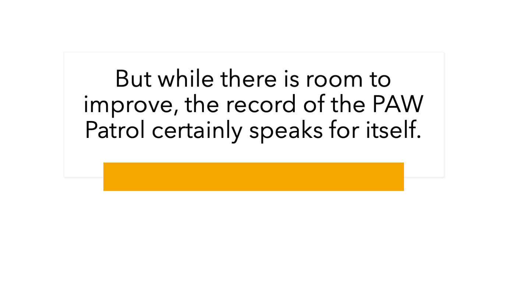
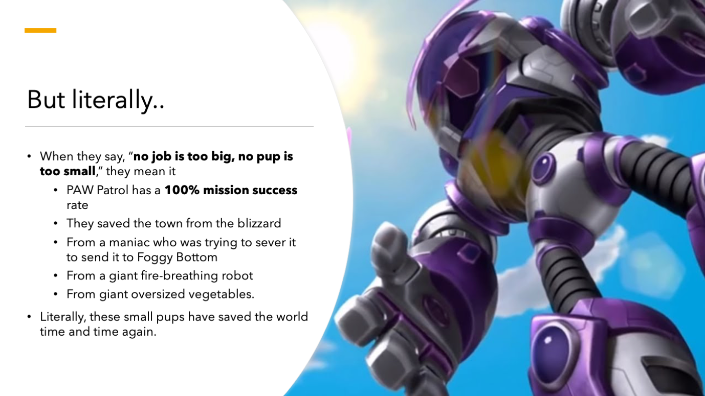
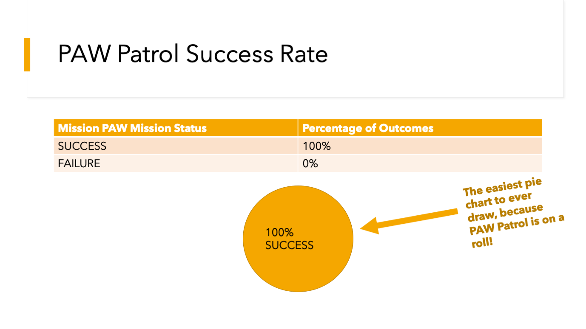
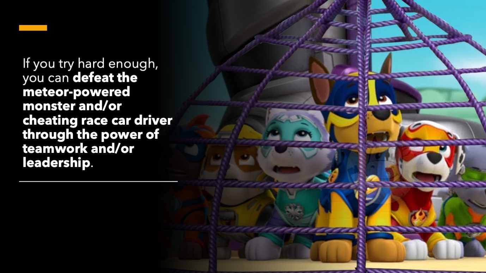
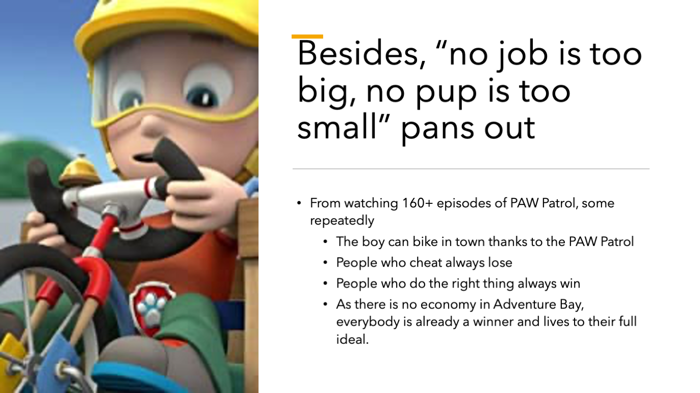
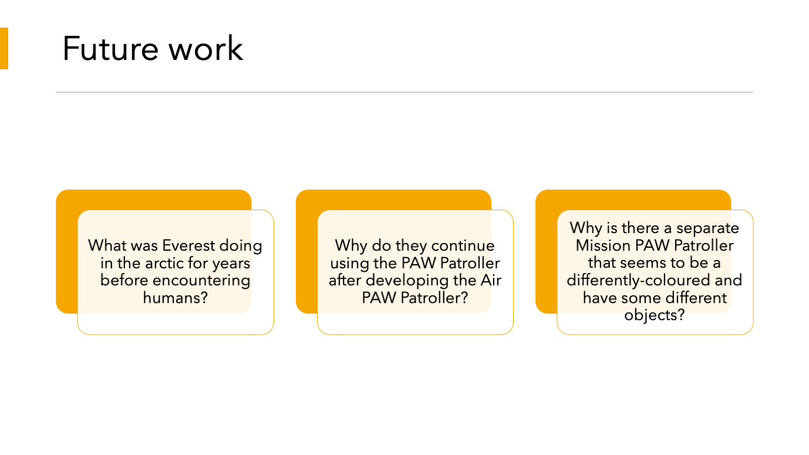
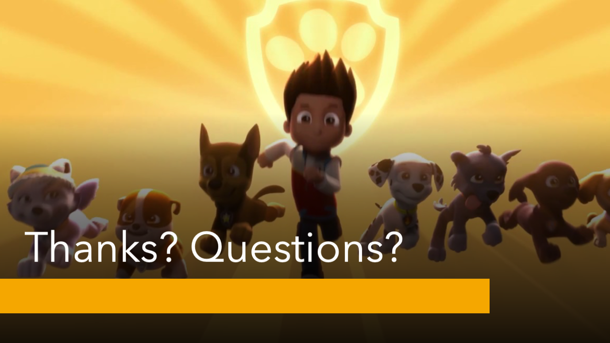
